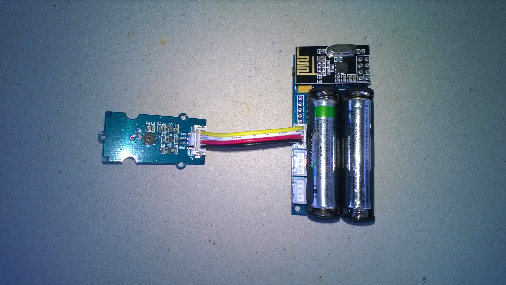

# FieldGateway.nRF24L01.devDuinoV2.2Client
Sample plug n play devDuino V2.2 client for my [nRF24L01](http://www.nordicsemi.com/eng/Products/2.4GHz-RF/nRF24L01) field gateway projects. 

The onboard [ASSHA204A](https://www.microchip.com/wwwproducts/en/ATSHA204A) makes provisioning easier as each device is guaranteed to have a unique identifier. (In coming versions of the software I will use the encryption capabilities).

With some gateways (e.g. AdaFruit.IO) the device will be configured "automagically" on first update and it's just a matter of changing the feed name to something human readable. For other gateways (e.g. Microsoft IoT Central) I use a label maker to print the device ID on the outside of the enclosure which can then be manually configured.

I have put in basic power conservation code which gives 4-6 weeks battery life depending on RF Power and update rate configuration so plenty of scope for improvement.

These devices are only USD18 each (Feb 2018) so I pass them out into the audience at conferences as part of SmartAG (temperature, humidity and light levels) or industrial monitoring (acceleration, temperature and proximity) scenario simulations. 

This clients uses
* [devDuino V2](https://www.elecrow.com/devicter-sensor-node-v22-atmega-328-with-support-ota-update-p-1485.html)
* [SeeedStudio Grove-Temperature & Humidity Sensor ](https://www.seeedstudio.com/Grove-Temperature%26Humidity-Sensor-%28High-Accuracy-%26-Mini%29-p-1921.html)
* [SeeedStudio Grove-Universal 4 Pin Buckled 5cm Cable](https://www.seeedstudio.com/Grove-Universal-4-Pin-Buckled-5cm-Cable-%285-PCs-Pack%29-p-925.html)

Would most probably work with [devDuino Relay 1 Node](https://www.elecrow.com/devduino-relay-1-node-v10-atmega-328-e2-80-93-with-support-ota-updat-p-1611.html) as it has an ATSHA204A as well.

I have "automagic provisioning" (hold the buttons down on the device & field gateway and they will find each other, like WPA) under devellopment.

Setup called
SNo:01 23 32 66 C6 FE 0B 8D EE 
TH02 setup
nRF24 setup
Setup done
Loop called
T:28.9C H:72% B:3.23V
Payload length:30
nRF24 write
Write Ok...
nRF24 power down
